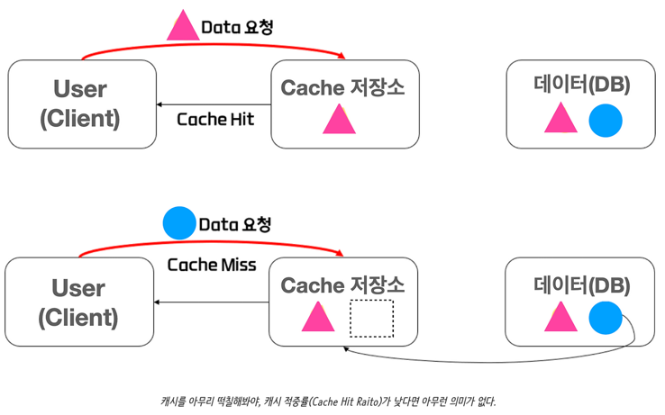

## 1. 캐싱 전략을 적용할 때의 원칙
---

- 캐시 적용은 신중하게 정하여야 한다. 캐시 만료나 Eviction이 제때 일어나지 않아 사용자가 잘못된 데이터를 받을 확률이 급증한다.
- 캐시를 적용하게 되면 관리 포인트가 늘게되면서 유지보수에서 힘들어질 수 있다. 캐시 적용이 유지보수 비용보다 항상 이득이 있어야 한다.
- 캐시의 이용성은 급격하게 쏠리는 유저 트래픽에 대한 방지책이다. 유저 트래픽이 쏠리지 않으면 구현할 필요가 없다.
- 캐시를 하려는 데이터의 유형을 잘 파악하여야한다. 데이터의 형태나 쓰임에 따라 글로벌, 로컬 캐시 어느 것을 사용할지 정하여야 하기 때문이다.

## 2. 콘서트 예약 서비스에서 사용되는 조회 기능들:
---

- 대기열 토큰 조회
- 예약 가능한 콘서트 조회
- 예약 가능한 좌석 조회
- 잔액 조회

콘서트 조회와 좌석예약 외의 다른 API에 캐시를 적용하기에 적합하지 않은 이유들은 다음과 같다.

- 대기열 토큰은 만료 시간이 빠르게 다가오고 캐시 Edit이 자주 일어나며 곧 레디스로 로직을 이관할 예정

- 잔액 조회는 사용자 마다 잔액을 조회하는 것이기에 성능 부하가 일어날 가능성이 적다.

위의 이유들은 여러 가정들을 전제로 구성한 문장들이다. 실제 현업에서는 캐시를 적용할 때 해당 API가 실제로

얼마나 사용되는지에 대한 데이터 측정값을 기반으로 결정을 하여야 한다.


## 3. 콘서트 조회가 캐싱이 적용시 생각한 점
---

- Cache Hit가 잘 일어날 것 인가


콘서트의 일정이나 내용이 잘변경되지 않는 다는 가정을 전제로 보았을 때 Cache Hit가 잘 일어날 듯하다.

사람들이 선호하는 콘서트는 정해져 있기에 특정 몇몇 콘서트로 Cache Hit가 빈번하게 일어날 것 이다.

이용자가 몰릴 경우에 특정 콘서트의 예약 가능 데이터가 빠르게 바뀔 수 있지만 다수의 사용자가

같은 콘서트 정보를 조회 요청을 하면서 Cache Hit가 빈번하게 일어날 가능성이 높다.

- 시간성 고려

선호 콘서트에 단기간에 많은 사용자가 몰릴 가능성이 높다

- 공간성 고려

콘서트를 알아본 후에 그 콘서트의 좌석을 바로 찾아볼 가능성이 높다.

인기 콘서트의 좌석 또한 사용자들이 많이 찾게 될 것 이다.

- 로컬, 글로벌 캐시 판단

콘서트만을 고려하게 된다면  차후에 WAS를 여러 대 운영을 하더라도 콘서트 조회 API는 캐시가 적용된 서버에만 가도록 조정하여서

사용할 수 있다. 서버간에 콘서트 정보를 공유할 필요도 없고 콘서트 정보가 빈번하게 변하지 않을 것이기 때문이다.

그러나 인기 콘서트의 좌석까지 캐시로 관리를 하고 싶다면 한개의 서버에서 처리하기에는 부하게 일어날 수 있다.

- 콘서트의 데이터 특성

정부에서 지원하는 지표 누리에 따르면 2017년에서 2022년까지 연간 공연 횟수의 최대 수는 57,907건이다

참고 https://www.index.go.kr/unity/potal/main/EachDtlPageDetail.do?idx_cd=1635

https://www.index.go.kr/unity/potal/indicator/IndexInfo.do?clasCd=8&idxCd=8036

갑자기 공연 횟수가 늘어서 60,000건이라고 가정을 한다. 예상되는 최대 공연 수는 60,000 건 

음악, 관람, 스포츠를 통틀어서 연간 최대 관람객 수는 약 3천만명이다.

그렇치만 가장 공연이 많은 10월 11월에 편차가 있을 것을 고려해 월간 최대 관람객 수를 5백만명으로 잡고

일간에 갑자기 몰리는 가능성을 고려해 약 DAU를 50만명으로 생각한다.

보통 일일 사용자의 10분의 1이 주요 기능을 한번에 같이 사용하기에 이 부분까지 고려하면

초당 5만 API 콜 정도의 폭주를 버틸 수 있으면 된다.

위의 모든 상황은 비즈니스가 국내에서 최대로 영역을 잠식했을 때를 가정한다.(나도 유니콘 갈래..)

사용자들이 예약하고 싶은 콘서트를 찾은 후에 바로 좌석 조회를 할 경우를 고려하면

예약 가능한 좌석 조회 기능 또한 폭주할 가능성이 높다.

초당 5만 API 콜을 좌석 조회 기능도 감당하여야 하지만 좌석 예약 테이블에 부담을 줄 수 있어서

트래픽 폭주를 방지하기 위해서 캐시가 필요하다는 결론이다.

## 4. 구현시 주의점
---

- 방식은 Write through를 이용한다.

예약 가능한 콘서트의 정보는 가능한 최신 상태를 유지하여아 하므로

어느 정도 데이터 일관성을 지원해주며

쓰기 작업이 들어갈 때 속도가 느려지지만

콘서트 정보가 그렇게 자주 바뀔 것 같지 않아서

Write through를 채용하기로 결정하였다.

- 실제 예약을 위한 대기열 요청시에는 캐시를 사용하지 않는다

예약을 위해서 콘서트와 좌석의 상태를 파악하는 부분에서는 데이터 정합성이 중요하기 때문에

캐시를 사용하지 않도록 한다.


## 5. 예약 가능한 콘서트 조회 
---

- 기능: 현재 예약 가능한 모든 콘서트를 조회합니다.
- 캐시 적용 체크리스:
  - 콘서트 예약을 위해서 하는 사용자들이 이용하는 첫 기능이며 이후의 API들 보다 높은 이용률을 보일 것 입니다.
  - 콘서트라는 데이터 특성상 예약 가능 유무 외에는 데이터가 변할 일이 잘 없습니다.
  - 구매와 같은 비즈니스적으로 크리티컬한 부분과 거리가 있습니다.
  - 데이터 정합성이 완벽할 필요는 없지만 고객이 느꼈을 때 어느 정도 정확하여야 합니다.
- 구현: 레디스 Write Through
```kotlin
fun getAvailableConcerts(): List<Concert> {

        val cache = cacheManager.getCache("concert")
        val cachedConcerts = cache?.get("availableConcerts", List::class.java) as? List<Concert>

        if (cachedConcerts != null) {
            return cachedConcerts
        }

        // 캐시에 없으면 DB에서 조회 후 캐시에 저장
        val availableConcerts = concertRepository.findAvailableConcerts()
        cache?.put("availableConcerts", availableConcerts)

        return availableConcerts
    } 
```
- 캐시 만료처리: TTL (24시간), 데이터가 잘 바뀌지 않을 것을 고려하여서 하루로 정하였습니다.

## 6. 예약 가능한 좌석 조회

- 기능: 특정 콘서트의 현재 예약 가능한 좌석을 조회한다
- 캐시 적용 체크리스트:
  - 특정 콘서트에 트래픽일 쏠리면서 연관 데이터인 해당 콘서트의 좌석 조회도 늘어날 것으로 예샹됩니다.
  - 좌석의 예약 가능 유무외에는 데이터가 잘 바뀌지 않습니다.
  - 예약 확정에 따른 구매 로직에는 캐시가 안들어간 좌석 조회로 하도록 합니다.
  - 현재 예약 가능한 좌석 조회는 비즈니스적으로 크리티컬한 부분과는 거리가 있습니다.
- 구현: 레디스 Write Through
```kotlin
// 콘서트 날짜 범위에 맞는 좌석을 조회하는 쿼리 메서드

//@Cacheable(value = ["availableSeats"], cacheManager = "redisCacheManager")
//fun findByConcertDateBetween(startDate: LocalDateTime, endDate: LocalDateTime): List<Seat> 
```
- 캐시 만료처리: TTL (24시간), 데이터가 잘 바뀌지 않을 것을 고려하여서 하루로 정하였습니다.

## 7. 테스트

레디스를 이용한 글로벌 캐시라서 환경세팅을 제대로 해서 테스트를 하여야 제대로된 결과물이 나올 것 같아서

성능 테스트는 스킵하였습니다.

간단하게 실제로 캐시로 저장된 값을 가져오는 테스트코드만 작성하였습니다.


