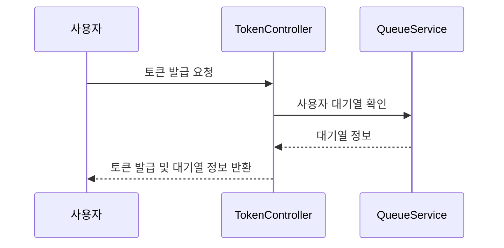
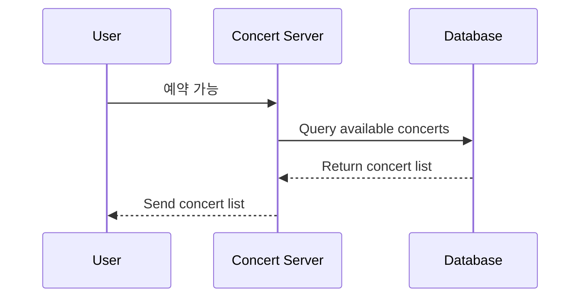
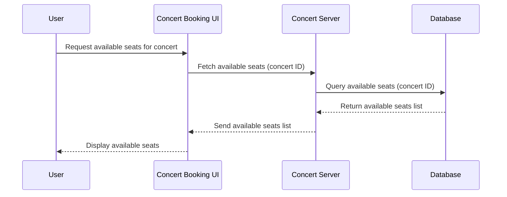
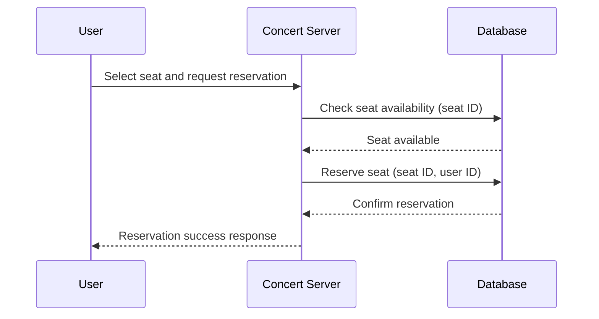
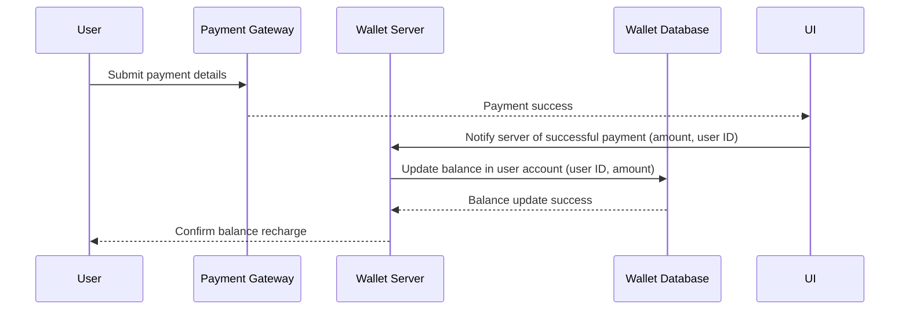
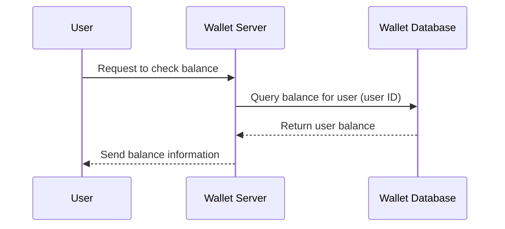

# 콘서트 예약 서비스

## 요구사항

- 기능
  - 유저 토큰 발급 API
  - 예약 가능 날짜 / 좌석 API
  - 좌석 예약 요청 API
  - 잔액 충전 / 조회 API
  - 결제 API
- 테스트
  - 기능 및 제약사항에 대한 테스트 (하나 이상)
  - 복수의 서버 인스턴스에서도 기능하도록 작성
  - 동시성 이슈 고려
  - 대기열 개념 고려
- 개발 환경
  - Architecture
      - Testable Business logics
      - 클린 + Layered Architecture
  - DB ORM: JPA
  - Test: JUnit

## 일정 마일스톤 

### 3주차
- 시나리오 분석 및 작업 계획 (시퀀스 다이어그램, 플로우 차트)
- ERD 설계 자료, API 명세, Mock API 작성, 패키지 구조, 서버 Config

### 4주차:
- 유저 대기열 토큰 기능 구현 및 테스트 코드 작성
- 예약 가능 날짜/ 좌석 API, 좌석 예약 요청 API 기능 구현 및 테스트 코드 작성
- 잔액 충전 / 조회 API 기능 구현 및 테스트 코드 작성

### 5주차:
- 결제 API 기능 구현 및 테스트 코드 작성
- 대기열 고도화

### 패키지 구조

```
/src
    /interfaces
        /api
            /concert
                ConcertController.kt
            /point
                PointController.kt
            /seat
                SeatController.kt
    /application
        /concert
            ConcertFacade.kt
            ConcertService.kt
        /point
            PointService.kt
        /seat
            UserService.kt
        /user
            UserService.kt
            
    /domain
        /concert
            Concert.kt
            ConcertRepository.kt 
        /point
            Point.kt
            PointRepository.kt
        /user
            User.kt
            UserRepository.kt
        /registration
            Registration.kt
            RegistrationRepository.kt
        /queue
    /infrastructure
        /concert
        /point
        /seat
        /user
```

## ERD 설계

## 시퀀스 다이어그램
#### 유저 토큰 발급


#### 예약 가능 날짜


#### 좌석 조회


#### 좌석 예약 요청

#### 잔액 충전

#### 잔액 조회

## API 명세

#### 유저 토큰 발급
- **GET** ```/token```
- Request
  - ```json
    {
      "id": "id", 
      "password": "password"
    }

- Response
  - ```200```
    - ```json
      { 
        "code": "success", 
        "message": "token provided",
        "token": "provided"
      }
  - cookie에 토큰 주입
  - ```401```
    - ```json
      {
        "code": "fail",
        "message": "authentication failed"
      }

#### 예약 가능한 콘서트 조회
- **GET** ```/concert```
- Response
  - ```200```
    - ```json
      {
        "code": "success",
        "concerts": []
      }

#### 예약 가능 좌석 조회
- **GET** ```/seat/{concertId} ```
- Response
  - ```200```
  - ```json
    {
      "code": "success",
      "seats": []
    }

#### 콘서트 예약 하기
- **POST** ```/seat/{concertId} ```
- Request
  - ```json
    {
      "code": "success",
      "concert": {
                    "name" : "concert",
                    "date" : "2024-12-01"
                  }
    } 
    
- Response
  - ```409```
  - ```json
    {
      "code": "fail",
      "message": "Invalid request, already occupied"
    }

#### 유저 포인트 조회
- **GET** ```/user/{userId}/point```
- Response
  - ```200```
  - ```json
    {
      "code": "success",
      "point": "123"
    }
#### 유저 포인트 충전
- **POST** ```/user/{userId}/charge ```
- Request
  - ```json
    {
      "amount": "amount"
    } 
- Response
  - ```200```
  - ```json
    {
      "code": "success",
      "point": "246"
    }

## Mock API