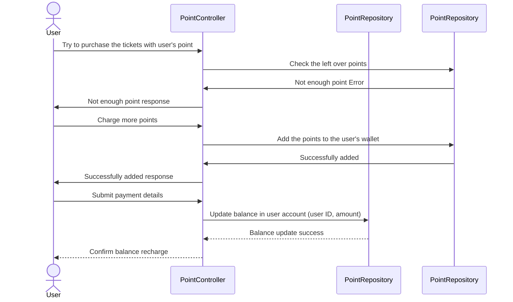
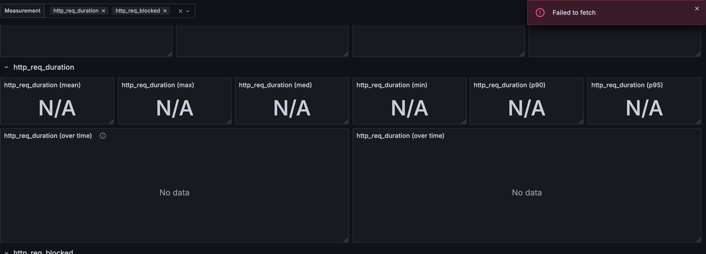

## 1. 사용자 시나리오

---


###  포인트 충전과 사용 및 조회

콘서트 예약 확정의 메인 로직들은 현재 카프카로 대체되어서 많은 작업량을 이미 처리할 수 있는

상태가 되어있지만 콘서트 예약 확정 중 포인트 사용 부분이 아직 이벤트로 대체되지 않아습니다.

스토리: 사용자가 포인트 사용을 시도 -> 실패 -> 포인트 조회 -> 포인트 충전

비즈니스적으로 봤을 때 중요한 부분인 결제 부분입니다.

그러나 서비스의 특성상 콘서트 예약 순번이 되면 사용자는 결제에서 번거로움을 겪더라도

어느 정도 불편함을 감수할 것 이라서 좀 더 크리티컬 할 수 있는

좌석 예약 부분을 집중적으로 봤습니다.





## 2. 목적

---

예약 확정을 시도하다가 에러가 나면서

구매이탈이 나는 것을 방지는 것이 목적입니다.

비즈니스적으로 가장 핵심적인 부분이라서 선정하게 되었습니다. (돈이 중요하다)


## 3. 부하 테스트 대상 선정

---

부하 테스트의 지표 선정입니다

- latency
- diskIO
- CPU
- Memory

Server Application을 도커에서 컨테이너로 올리면서

한정되 CPU, Memory가 주어지면 어느 정도의 부하를 견디는지

또한 JVM과 Server App의 메모리를 어느 정도 맞추어 주어야할지 테스트해봅니다.

Docker 환경에서 웹 어플리케이션 서버는 cpu 1코어와 메모리 1GB로 진행하였습니다.

```yaml

version: '3'
services:
  app:
    build:
      context: .
    ports:
      - "8080:8080"
    container_name: "backend"
    deploy:
      resources:
        limits:
          cpus: '1'
          memory: 1G
    environment:
      - SPRING_PROFILES_ACTIVE=test
    networks:
      - spring-network

  redis:
    image: redis:7.0.5
    container_name: redis
    ports:
      - "6379:6379"
    restart: always
    networks:
      - spring-network

  zookeeper:
    image: "wurstmeister/zookeeper"
  kafka:
    image: "wurstmeister/kafka"
    ports:
      - "9092:9092"
    depends_on:
      - "zookeeper"
    environment:
      KAFKA_ZOOKEEPER_CONNECT: "zookeeper:2181"
      KAFKA_ADVERTISED_HOST_NAME: "${KAFKA_HOST:-localhost}"
      KAFKA_ADVERTISED_PORT: "9092"
      KAFKA_AUTO_CREATE_TOPICS_ENABLE: "false"

  k6:
    image: grafana/k6
    volumes:
      - ./k6s:/scripts
    command: run /scripts/stressTest.js
    networks:
      - spring-network

  grafana:
    image: grafana/grafana
    ports:
      - "3000:3000"
    environment:
      - GF_AUTH_ANONYMOUS_ORG_ROLE=Admin
      - GF_AUTH_ANONYMOUS_ENABLED=true
      - GF_AUTH_BASIC_ENABLED=false
    volumes:
      - ./docker/dashboards:/var/lib/grafana/dashboards
      - ./docker/grafana-dashboard.yaml:/etc/grafana/provisioning/dashboards/dashboard.yaml
      - ./docker/grafana-datasource.yaml:/etc/grafana/provisioning/datasources/datasource.yaml
    networks:
      - spring-network

  prometheus:
    image: prom/prometheus
    volumes:
      - ./prometheus.yml:/etc/prometheus/prometheus.yml
    networks:
      - spring-network

  influxdb:
    image: influxdb:1.8
    networks:
      - spring-network
    ports:
      - "8086:8086"
    environment:
      - INFLUXDB_DB=k6

networks:
  spring-network:

```


## 5. 테스트 스크립트

테스트는 좌석 예약 확정시 각각의 스텝에서 정상적으로 상태가 진행되는지와

폭발적인 api 요청을 전제로 작성하였습니다.


```js
import http from 'k6/http';
import { check, sleep } from 'k6';

// 테스트 옵션 설정
export let options = {
    vus: 50, // 가상 사용자 수
    duration: '5m', // 테스트 실행 시간
    thresholds: {
        http_req_duration: ['p(95)<2000'], // 95%의 요청이 2초 이내에 완료되어야 함
    },
};

const BASE_URL = 'http://app:8080';

export function setup() {
    const initialUserId = 1;
    const setupRes = http.post(`${BASE_URL}/api/v1/token`,
        JSON.stringify({ userId: initialUserId }),
        { headers: { 'Content-Type': 'application/json' } }
    );
    return { setupToken: setupRes.json().data.queueToken };
}

export default function () {
    // POST 요청: 예약 확인
    const reservationId = Math.floor(Math.random() * 10000) + 1; // 무작위 예약 ID 생성
    const response = http.post(`${BASE_URL}/reservations/confirm`,
        JSON.stringify({ reservationId: reservationId }),
        { headers: { 'Content-Type': 'application/json' } }
    );

    // 응답 상태 확인
    check(response, {
        'status is 200': (r) => r.status === 200,
    });

    // 사용자별 대기
    sleep(1);
}


export function setup() {
    const initialUserId = 1;
    const setupRes = http.post(`${BASE_URL}/queue/token`,
        JSON.stringify({ userId: initialUserId }),
        { headers: { 'Content-Type': 'application/json' } }
    );
    return { setupToken: setupRes.json().data.queueToken };
}

export default function (data) {
    const userId = Math.floor(Math.random() * 100000) + 1; // 사용자 ID 범위: 1 ~ 100,000

    // 1. 토큰 발급
    const tokenRes = http.post(`${BASE_URL}/queue/token`,
        JSON.stringify({ userId: userId }),
        { headers: { 'Content-Type': 'application/json' } }
    );

    check(tokenRes, { '토큰 생성 성공': (r) => r.status === 200 });
    const token = tokenRes.json().data.queueToken;

    // 2. 대기열 확인
    let queueStatus = 'WAITING';
    let attempts = 0;
    const maxAttempts = 3;
    const waitTime = 1;

    while (queueStatus !== 'SUCCESS' && attempts < maxAttempts) {
        const queueRes = http.post(`${BASE_URL}/queue/token/check`, null, {
            headers: { 'Content-Type': 'application/json', 'Authorization': token }
        });

        check(queueRes, { '대기열 확인 성공': (r) => r.status === 200 });
        queueStatus = queueRes.status === 200 ? queueRes.json().data.status : queueStatus;

        if (queueStatus === 'SUCCESS') break;

        attempts++;
        sleep(waitTime); // 대기
    }

    if (queueStatus === 'SUCCESS') {
        // 3. 콘서트 스케줄 조회
        const scheduleRes = http.get(`${BASE_URL}/concerts/schedule`, {
            headers: { 'Content-Type': 'application/json', 'Authorization': token }
        });

        check(res, { '스케줄 조회 성공': (r) => r.status === 200 });

        if (res.status === 200 && res.json().data.length > 0) {
            const seatId = res.json().data.first().seatId;

            // 4. 좌석 조회
            const seatRes = http.get(`${BASE_URL}/concerts/seat?=${seatId}`, {
                headers: { 'Content-Type': 'application/json', 'Authorization': token }
            });

            check(seatRes, { '좌석 조회 성공': (r) => r.status === 200 });
        }
    } else {
        console.warn(`사용자 ${userId}은 PROGRESS 상태에 도달하지 못했습니다.`);
    }

    sleep(1);
}

export function teardown(data) {
    console.log('테스트 완료');
}

```

## 6. Test 결과

```text
     checks.........................: 100.00% 2000 out of 2000
     data_received..................: 521 kB  8.3 kB/s
     data_sent......................: 762 kB  9.6 kB/s
     http_req_blocked...............: avg=51.69µs  min=897ns  med=3.21µs   max=8.42ms p(90)=11.21µs  p(95)=632.36µs
     http_req_connecting............: avg=51.47µs  min=0s     med=0s       max=9.56ms p(90)=0s       p(95)=491.26µs
   ✗ http_req_duration..............: avg=1.02s    min=8.14ms med=217.36ms max=10.21s p(90)=1.73s    p(95)=9.21s
       { expected_response:true }...: avg=1.02s    min=8.14ms med=217.36ms max=10.21s p(90)=1.73s    p(95)=9.21s
   ✓ http_req_failed................: 0.00%   0 out of 2000
     http_req_receiving.............: avg=454.11µs min=0s med=137.35µs max=37.12ms  p(90)=665.57µs p(95)=1.2ms   
     http_req_sending...............: avg=64.26µs  min=0s med=24.75µs  max=23.54ms  p(90)=94.66µs  p(95)=159.31µs
     http_req_tls_handshaking.......: avg=0s       min=0s     med=0s       max=0s     p(90)=0s       p(95)=0s
     http_req_waiting...............: avg=1.13s    min=9.06ms med=206.98ms max=14.69s p(90)=2.46s    p(95)=10.4s
     http_reqs......................: 2000    25.285703/s
     iteration_duration.............: avg=37.23s   min=26.31s med=31.75s   max=51.37s p(90)=52.12s   p(95)=53.51s
     iterations.....................: 79      0.933849/s
     vus............................: 150     min=150            max=150
     vus_max........................: 150     min=150          max=150
```

### 성능 지표 결과

요청수: 2000
성공한 요청수: 2000
실패한 요청수: 0
평균 응답 시간: 1.02초
최소 응답 시간: 8.14ms
최대 응답 시간: 10.21s
p90 응답 시간: 1.73s
p95 응답 시간: 9.21s


요청에 대한 응답은 정상적으로 이루어지나 평균 응답시간과 최대 응답시간 그리고 p95에서의 응답 지연이 크기 때문에 랜덤한 특정 사용자에게

좋지 않은 서비스 경험을 제공할 가능성이 높습니다.


## 6. 5Why 기법

또 당신입니까 도요타.

도요타 자동차 회사의 오노 타이치에 의해 고안된 기법.

가정과 논리함정에 빠지지 말고 명확한 인과관계만을 추정해서 근본 원인을 찾는 방법.

대략 5번 정도 왜 일어났는지를 트레이싱하면 근본 원인이 나오더라는 휴리스틱 방식의 기법.

## 7. 성능 저하 원인

웹 서비스 컨테이너의 한정적인 CPU와 Memory로 성능 저하가 의심됩니다.

컨테이너간 네트워크 IO, DB의 쓰레드가 잡히면서 일어나는 과부화과 있습니다.


## 8. 해결책

단기간 work-around로 스케일 업과 스케일 아웃을 통햅 WAS 성능을 끌어올립니다.

WAS와 DB간의 쓰레드 조정을 실시합니다.

DB에서 일어나는 쿼리에 대한 최적화를 진행합니다.

서킷브레이커를 설정하여 이번 테스트에서는 일어나지 않았지만 500 error에 대한 대책을 세운다.

## 8. Grafana k6를 이용한 모니터링

k6, influx, prometheus, Grafana를 이용하여 데이터 시각화와 알림 기능을 세팅해보려고 했습니다만.



아쉽게도 제가 컨테이너 네트워크 설정에 미숙해서 데이터 fetching을 정상적으로 못해오고 있습니다.

현업에서 쓰는 것 처럼 임계치에 도달하면 담당자들에게 slack 메시지와 이메일을 날리는 기능도 넣어서 주기적으로

장애 관련 모니터링을 하는게 좋습니다.


