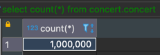
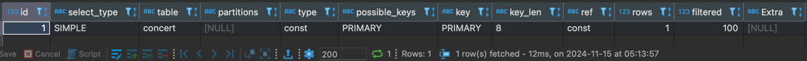
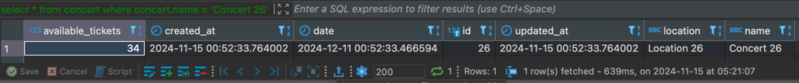
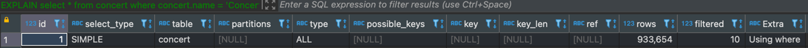
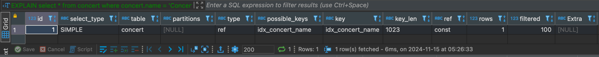
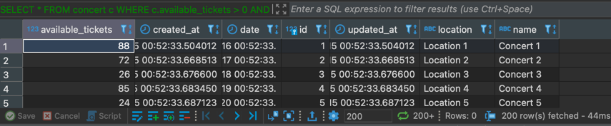
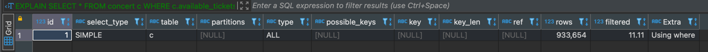
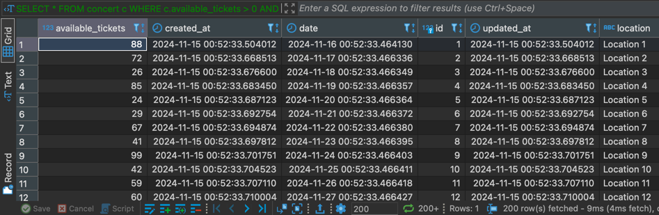
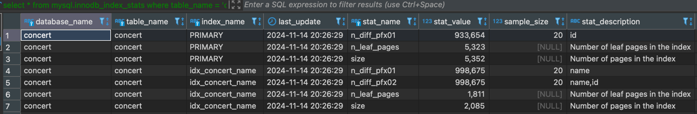

# 1. 실행되는 쿼리 

---

### 1. 예약가능 콘서트 조회
- SELECT * FROM concert c WHERE c.availableTickets > 0 AND c.date > CURRENT_TIMESTAMP

### 2. 콘서트 이름으로 콘서트 조회
- SELECT * FROM concert c WHERE c.id = concertId

### 3. 콘서트 아이디로 콘서트 조회
- SELECT * FROM concert c WHERE c.name = concertName

### 4. 유저 아이디로 포인트 조회
- SELECT * FROM point p WHERE p.userId = userId

### 5. 구매완료가 되지 않은 예약 조회
- SELECT * FROM reservation r WHERE r.status = 'RESERVED' AND r.createdAt < :expiryTime

### 6. 예약가능한 좌석 조회
- SELECT * FROM seat s WHERE s.concert = concertId AND CURRENT_TIMESTAMP > s.startDate AND CURRENT_TIMESTAMP < s.endDate 

# 2. 인덱스를 설정할 테이블 선정

---

### 1. 예약가능한 콘서트 조회
- SELECT * FROM concert c WHERE c.availableTickets > 0 AND c.date > CURRENT_TIMESTAMP

### 2. 콘서트 이름으로 콘서트 조회
- SELECT * FROM concert c WHERE c.name = concertName

# 3. EXPLAIN을 통한 실행 계획 확인과 인덱싱 성능 비교

---

### 1. 콘서트 이름으로 콘서트 조회 케이스

가장 간단하면서 이미 Primary key로 id가 걸려있는 콘서트 아이디로 콘서트를 조회해 보았다.




콘서트 레코드가 백만건이지만 12ms로 굉장히 빠르게 조회를 하는 것을 확인 할 수 있다.

Explain을 이용하여서 나오는 결과값은 다음과 같다.

```sql
/* select#1 */ select '34' AS `available_tickets`,'2024-11-15 00:52:33.764002' AS `created_at`,'2024-12-11 00:52:33.466594' AS `date`,'26' AS `id`,'2024-11-15 00:52:33.764002' AS `updated_at`,'Location 26' AS `location`,'Concert 26' AS `name` from `concert`.`concert` where true

```

조회를 할 때 옵티마이저가 인덱스를 타고 가면서 상수들을 보여주게 된다.

인덱스가 적용되지 않은 concert.name 컬럼으로 조회를 하면 다음과 같다.

콘서트 이름은 현재 인덱스가 걸리지 않은 상태이다.



id로 조회했을 때 12ms가 걸리는 것에 비해서 639ms로 확연히 차이가 난다.

EXPLAIN 구문을 쓴 결과는 다음과 같다.



type이 ALL이면서 인덱스를 안타는 것을 확인할 수 있다.

간단하게 concert.name에 인덱스를 걸고 재조회를 하면 6ms로 조회 성능이 향상 된 것을 확인 할 수 있다.




### 2. 예약가능한 콘서트 조회


```sql
SELECT * FROM concert c WHERE c.available_tickets > 0 AND c.date > CURRENT_TIMESTAMP;
```

SQL쿼리를 실행해보면 44ms의 실행속도를 보여주는 것을 확인할 수 있다.



EXPLAIN으로 확인을 해보니 인덱스를 안타고 있다.



예약가능한 잔여 티켓을 의미하는 available_tickets 컬럼은 update가 자주될 가능성이 높아서

잘 변경이 안될 date에만 인덱스를 걸어 주었다.



4ms로 조회 성능이 향상된 것을 확인할 수 있다.


# 4. 테이블 통계정보

---

인덱스를 타고 말고는 테이블의 통계정보에 달려있다. 1억개의 레코드가 있는 테이블이더라도 통계정보가 없으면 그냥 풀스캔을 한다.

통계정보는 innodb_index_stats와 innodb_table_stats에 저장된다

아래는 콘서트 테이블의 통계정보이다.



인덱스를 타지 않거나 인덱스를 걸었는데도 성능이 이상하면 해당 테이블에서 수치를 확인할 수 있다.


# 5. 결론

---

 레디스를 이용한 캐시는 임시방편에 가깝다. 장애가 자주 발생하는 DB에서의 대부분 문제는 데드락 이슈나 조회 성능 문제이다. 

데이터 량과 비즈니스 요구사항에 의해서 파티셔닝이나 샤딩을 해야할 경우도 있지만 많은 부분이 인덱스 설정만 잘해주어도

해결이 된다. 인덱싱을 할 때는 DB에서 제공하는 통계 수치와 실제 테스트 성능을 기반으로 진행을 하여야 한다.

 이번에는 Bulk Insert를 이용하여서 DB에 테스트를 적재하였지만 @sql을 이용하여서 테스트 코드와 sql파일을 통해서

적재하는게 좀 더 깔끔할 것 같다.


